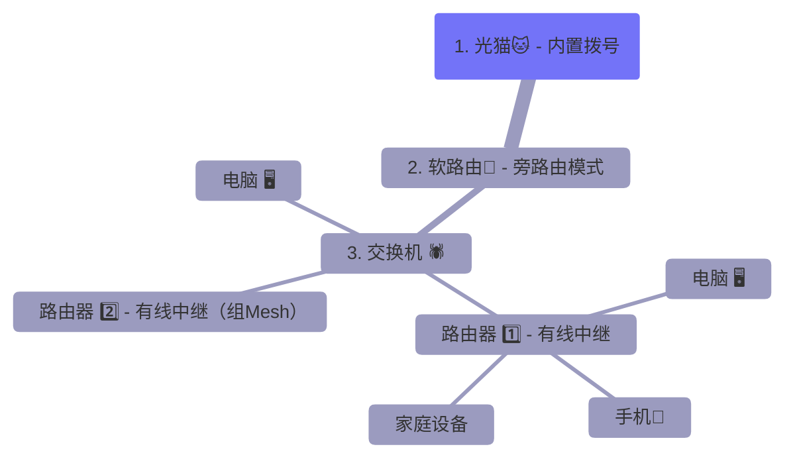

### 方案: 最通用

```mermaid
---
config:
  theme: neo
---
mindmap
  root(1. 光猫🐱 - 内置拨号)
    2. 软路由🐙 - 旁路由模式
      3. 交换机 🕷️
        电脑 🖥️
        路由器 1️⃣ - 有线中继
          手机📱
          电脑 🖥️
          家庭设备
        路由器 2️⃣ - 有线中继（组Mesh）
```
方案亮点：
1. 最简单，如果软路由层面有问题，则直接把它去掉，让交换机直连光猫即可正常使用，排查问题快
2. 所有设备可以通过软路由层面实现分流，设备端无需做任何设置
